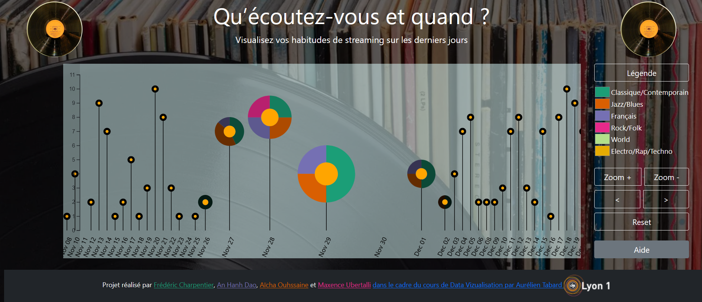

# Music streaming data

Ce projet vise à visualiser son utilisation quotidienne de la musique en streaming en ligne, à mettre en évidence la quantité d'albums écoutée quotidiennement, ainsi que la répartition des genres musicaux et son évolution dans le temps.

Il présente une vue combinée d'un histogramme représentant le nombre d'albums écoutés chaque jour et des camemberts donnant la répartition des genres musicaux de ces albums qui apparait lorsque la souris se positionne sur les données d'un jour.
