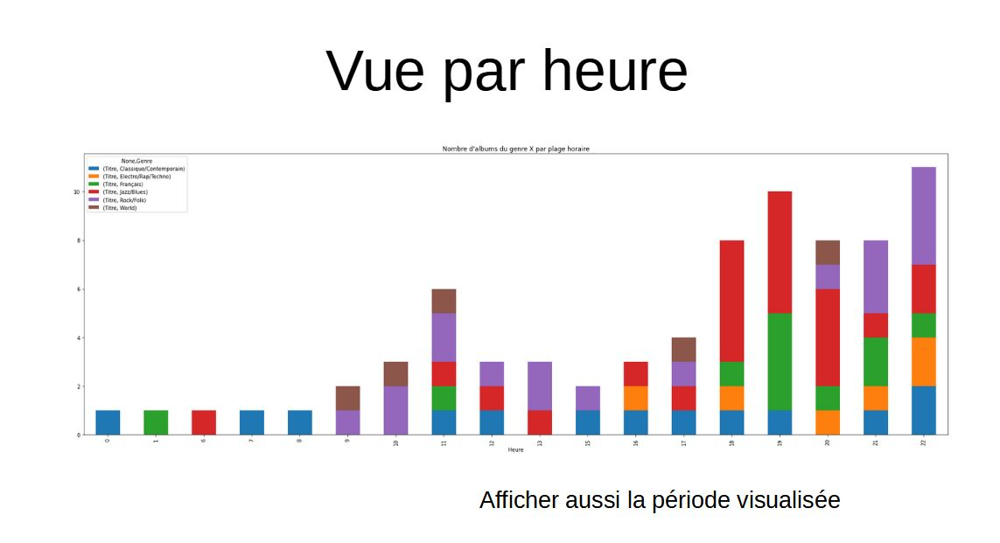

# Music Streaming Dataviz

## Quel est le problème abordé / à quel besoin répondez vous ? 

La visualisation s’adresse avant tout à l’utilisateur, qui n’a sans doute qu’une conscience approximative de son comportement d’écoute en ligne.
Selon la richesse des données qui seront exploitées, il s’agira, à partir des données d'un membre du groupe (pour plusieurs membres éventuellement) de mettre en évidence :

- A quels moments écoute-t-il de la musique en ligne (jours de la semaine, horaires (matin, soir...), période de l’année (été, hiver, vacances…) ?
- Quelle musique écoute-t-il (genres, artistes, albums les plus écoutés…) et mise en évidence des éventuelles corrélations avec le moment de l’écoute
- Visualiser les temps d’écoute (période/jour/horaire et temps/nombre de titres/albums écoutés), et les relier aux jours de la semaine/périodes de l’année
- Classifier les styles musicaux pour permettre une visualisation cohérente (regroupement en styles assez génériques mais significatifs)

On hold:
- Evaluation de la popularité de la musique écouté (comparaison avec les statistiques globales de musique en ligne)
- Chercher des profils utilisateurs différents sur un même compte partagé de musique en ligne (ceci étant une hypothèse très incertaine).

## Sources de données choisies 

Sources confirmées:
- Deezer (json) + Base de données personnelle (csv)
Sources à confirmer: 
- Spotify (?) / iTunes (XML)
Sources a priori non utilisées:
- Qobuz (données non accessibles, manque de contact chez Qobuz)

Les sources Deezer, Spotify et iTunes ont l’intérêt d’être des sources réelles. Elles pourraient éventuellement être fusionnées selon le degré de compatibilité/de modification nécessaires pour permettre cette fusion.

La Base de données personnelle disponible est un Fichier Excel avec une liste de quelques 500 albums à partir de laquelle est générée aléatoirement (mais selon des poids dépendant d'un profil utilisateur qui définis des  probabilités par jour/heure/genres...).

## Travaux important liés au projet 

- Données globales (non personnelles) sur l’écoute de musique en ligne:
https://www.analyticsvidhya.com/blog/2020/12/exploring-the-tale-of-music-through-data-visualization/#h2₄ 
https://public.tableau.com/app/profile/scott.teal/viz/SpotifyWebinar/Dashboard1
- Données personnelles sur Deezer :
https://stateezticsapp.com/
- A lire de manière plus approfondie
https://www.academia.edu/21823524/Using_Music_Streaming_Services_Practices_Experiences_and_the_Lifeworld_of_Musicking

https://www.academia.edu/40603195/Infinite_content_and_interrupted_listening_The_impact_of_smartphones_streaming_and_music_superabundance_on_everyday_personal_music_listening_behaviour

https://www.academia.edu/40119182/The_Daily_Use_of_Music_Streaming_Platforms_by_the_Dutch_Millennial_Age_Group

- ?

https://musicmap.info/

https://github.com/regorxxx/Music-Graph

https://www.presse-citron.net/sur-spotify-comment-voir-quel-est-votre-titre-le-plus-ecoute/

https://stateezticsapp.com/

https://music.apple.com/replay

## Organisation 
- Communication : Nous utilisons l'outil de gestion de projet Trello
- Sessions de travail : Travail personnel sur tâches spécifiques + revues de groupe hebdomadaires 
- Rôles au sein du groupe (design, développement D3, pré-traitement des données, suivi, etc.). Au cas par cas. 

## Scan des esquisses finales 

Souris sur une barre(un disque) :
- Le disque pivote selon l’axe vertical pour être vue de face : camembert représentant la répartition par genre
- Idéalement : les barres latérales s’écartent pour laisser la vue pleine du disque de face. Sinon : Disque plein en superposition.

Transitions d'une vue (jour/heure/période...) à l'autre :
- Idéal : les disques éclatent en morceaux qui se déplacent pour reformer les nouvelles barres (toujours sous forme de disques vus de côté)
- Sinon : Déplacement et reshape des disques

Sélection de "Show genre" : Les disques pivotent selon l’axe horizontal pour former une pile de disque dont la tranche est colorée (couleur correspondant à un genre)
(ce « pivotement » est à évaluer...)

